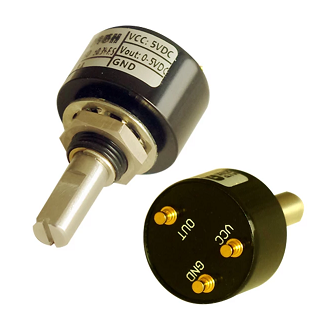

## Pot Adapter Board

This board is designed to adapt generic hall effect potentiometers to use the same JST connector as Sensatec pots, such as the one used in the Sound Voltex volume knob assembly.

### Download

Download the gerbers from this folder, it is the only \*.zip file.

### Potentiometer

The potentiometer can be found by using various keywords such as "Non-contact Angle Sensor", "360 Degrees", "Digital Potentiometer".  
The manufacturer is listed on the pot as PandAuto and the part number is P3020-V1-CW360.  
One such link: https://www.aliexpress.com/item/4000112340019.html  

As of writing (2022-05) the price is about $20USD/ea.

### PCB

The PCB is designed to be a single layer. Standard board thickness (1.6mm) and all default options should suffice.

### JST Connector

The other component on the board is JST P/N S3B-ZR. This matches the connector on the Sensatec encoder, providing drop-in capabilities.