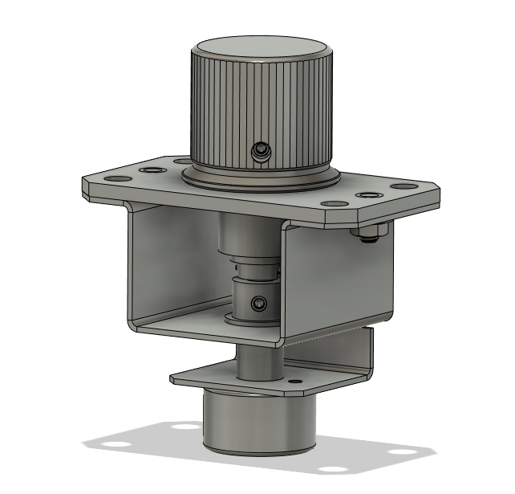

## Konami Volume Assembly

This is a full model of the Volume Assembly from a Sound Voltex Nemsys machine.

I've swapped the hardware and bushings out for items from McMaster, but part numbers for the official hardware can be found on the [GameRepair.info](https://gamerepair.info/parts/79_sound_voltex_volume_assembly) page.

Unfortunately, the small washer does not have a direct McMaster equivalent. I would probably use [this washer](https://www.mcmaster.com/91545A450/) with a few layers of scotch tape to shim the missing height.

Replacement knobs can be found at:
* [Speedy Labs](https://www.speedylabs.us/product/sound-voltex-aluminum-arcade-knob/)
* [Blue Spring Express](https://bluespringexpress.net/en-us/products/acknob)

Other replacement parts can be found  at:
* [YubiParts](https://yubiparts.com/)

Full BOM for McMaster equivalents coming soon.
